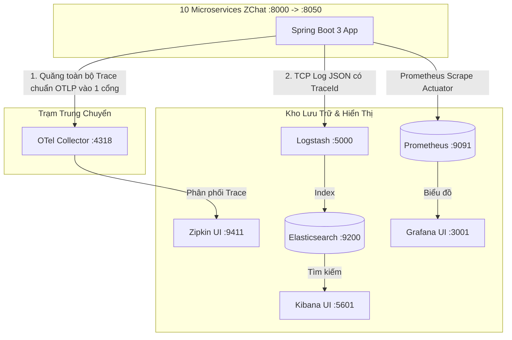

# 🚀 Kịch Bản Tích Hợp Chuẩn Enterprise: OpenTelemetry Collector + Zipkin + Prometheus + Grafana + ELK

Tài liệu này nâng cấp kiến trúc giám sát của **ZChat** lên tiêu chuẩn **Doanh nghiệp lớn (Enterprise Grade)** bằng cách đặt **OpenTelemetry Collector (OTel Collector)** làm trạm trung chuyển trung tâm. 

Thay vì 10 microservices phải tự kết nối lẻ tẻ đến nhiều công cụ khác nhau, toàn bộ ứng dụng chỉ gửi dữ liệu về **1 cổng duy nhất** (`4318`) của OTel Collector.

---

## 1. Bức Tranh Kiến Trúc Chuẩn Enterprise



---

## 2. Bước 1: Cập nhật `docker-compose.yml`

Bổ sung container `otel-collector` cùng bộ tứ giám sát vào `docker-compose.yml`:

```yaml
  # ==================== ENTERPRISE OBSERVABILITY STACK ====================

  # 1. Trạm trung chuyển trung tâm OTel Collector
  otel-collector:
    image: otel/opentelemetry-collector-contrib:latest
    container_name: otel-collector
    command: ["--config=/etc/otel-collector-config.yml"]
    volumes:
      - ./otel-collector-config.yml:/etc/otel-collector-config.yml
    ports:
      - "4317:4317" # OTLP gRPC receiver
      - "4318:4318" # OTLP HTTP receiver
    depends_on:
      - zipkin
    restart: unless-stopped

  # 2. Distributed Tracing UI
  zipkin:
    image: openzipkin/zipkin:latest
    container_name: zipkin
    ports:
      - "9411:9411"
    restart: unless-stopped

  # 3. Metrics Collector
  prometheus:
    image: prom/prometheus:latest
    container_name: prometheus
    volumes:
      - ./prometheus.yml:/etc/prometheus/prometheus.yml
    ports:
      - "9091:9090" # Tránh đụng Keycloak 9090
    restart: unless-stopped

  # 4. Visualization Dashboard
  grafana:
    image: grafana/grafana:latest
    container_name: grafana
    ports:
      - "3001:3000" # Tránh đụng Frontend React 3000
    environment:
      - GF_SECURITY_ADMIN_PASSWORD=admin
    depends_on:
      - prometheus
    restart: unless-stopped

  # 5. Log Shipper
  logstash:
    image: docker.elastic.co/logstash/logstash:8.15.0
    container_name: logstash
    ports:
      - "5000:5000/tcp"
    environment:
      - "LS_JAVA_OPTS=-Xms256m -Xmx256m"
    volumes:
      - ./logstash.conf:/usr/share/logstash/pipeline/logstash.conf
    depends_on:
      - elasticsearch
    restart: unless-stopped
```

---

## 3. Bước 2: Tạo cấu hình Trạm trung chuyển `otel-collector-config.yml`

Tạo file `otel-collector-config.yml` ngang hàng với `docker-compose.yml`. Định nghĩa bộ tiếp nhận (Receivers), gia công (Processors) và phân phối (Exporters):

```yaml
receivers:
  otlp:
    protocols:
      grpc:
        endpoint: 0.0.0.0:4317
      http:
        endpoint: 0.0.0.0:4318

processors:
  batch:
    timeout: 1s
    send_batch_size: 1024

exporters:
  # Xuất dấu vết sang Zipkin
  zipkin:
    endpoint: "http://zipkin:9411/api/v2/spans"
    format: json
  # In log debug ra console của OTel Collector để kiểm tra
  debug:
    verbosity: basic

service:
  pipelines:
    traces:
      receivers: [otlp]
      processors: [batch]
      exporters: [zipkin, debug]
```

---

## 4. Bước 3: Cài đặt Exporter Chuẩn Quốc Tế trong `common/pom.xml`

Thay vì cài Exporter riêng lẻ cho Zipkin hay Jaeger, ta dùng thư viện Exporter chuẩn chung OTLP:

```xml
<!-- Gửi tín hiệu chuẩn OTLP sang OTel Collector -->
<dependency>
    <groupId>io.opentelemetry</groupId>
    <artifactId>opentelemetry-exporter-otlp</artifactId>
</dependency>
```

---

## 5. Bước 4: Cấu hình Spring Boot chuyển tín hiệu về Collector (`application.yml`)

Tại file cấu hình chung của Config Server (`config-server/.../application.yml`), trỏ endpoint về cổng `4318` của OTel Collector:

```yaml
management:
  tracing:
    sampling:
      probability: 1.0 # 100% request được ghi nhận
  otlp:
    tracing:
      endpoint: http://localhost:4318/v1/traces # Quăng toàn bộ dấu vết vào OTel Collector

  endpoints:
    web:
      exposure:
        include: "health,info,prometheus,metrics" # Cho phép Prometheus hút số liệu
```

---

## 6. Cấu hình phụ trợ (`prometheus.yml` & `logstash.conf`)

**File `prometheus.yml` (Hút số liệu từ dải port 8000 -> 8050):**
```yaml
global:
  scrape_interval: 15s

scrape_configs:
  - job_name: 'zchat-microservices'
    metrics_path: '/actuator/prometheus'
    static_configs:
      - targets:
          - 'host.docker.internal:8000' # Gateway
          - 'host.docker.internal:8010' # User
          - 'host.docker.internal:8020' # Chat
          - 'host.docker.internal:8030' # Notification
          - 'host.docker.internal:8040' # Search
          - 'host.docker.internal:8050' # Storage
```

**File `logstash.conf` (Hứng log JSON đổ vào Elasticsearch):**
```conf
input {
  tcp {
    port => 5000
    codec => json_lines
  }
}
output {
  elasticsearch {
    hosts => ["http://elasticsearch:9200"]
    index => "zchat-logs-%{+YYYY.MM.dd}"
  }
}
```

---

## 7. Danh Mục Cổng Truy Cập (Port Directory)

Khởi động hệ thống bằng lệnh `docker-compose up -d`. Bảng tổng hợp cổng vận hành:

| Dịch vụ / Công cụ | Cổng (Port) | URL Truy cập | Tài khoản | Vai trò trong hệ thống |
| :--- | :---: | :--- | :---: | :--- |
| **OTel Collector**| `4318` | `http://localhost:4318` | — | Trạm trung chuyển nhận tín hiệu OTLP |
| **API Gateway** | `8000` | `http://localhost:8000` | — | Mặt tiền duy nhất cho Frontend |
| **User Service** | `8010` | `http://localhost:8010` | — | Microservice quản lý người dùng |
| **Chat Service** | `8020` | `http://localhost:8020` | — | Microservice nhắn tin thời gian thực |
| **Notification** | `8030` | `http://localhost:8030` | — | Microservice thông báo Push/SSE |
| **Search Service** | `8040` | `http://localhost:8040` | — | Microservice tìm kiếm Elasticsearch |
| **Storage Service**| `8050` | `http://localhost:8050` | — | Microservice lưu trữ file MinIO |
| **Grafana UI** | `3001` | `http://localhost:3001` | `admin / admin` | Táp-lô biểu đồ con số Server/APIs |
| **Zipkin UI** | `9411` | `http://localhost:9411` | — | Sa bàn theo dõi thời gian phản hồi |
| **Kibana UI** | `5601` | `http://localhost:5601` | — | Tra cứu log văn bản lỗi theo `TraceId` |
| **Prometheus** | `9091` | `http://localhost:9091` | — | Kho chứa dữ liệu Time-series cho Grafana |
