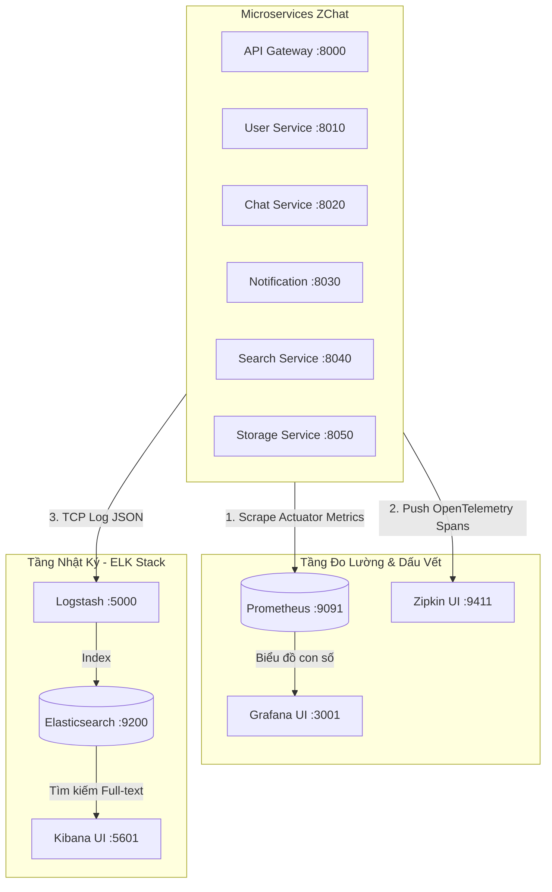

# 🚀 Kịch Bản Tích Hợp Toàn Diện: Zipkin + Prometheus + Grafana + ELK Stack

Tài liệu này là cẩm nang thực chiến từng bước (Step-by-Step Recipe) để triển khai "Siêu giám sát toàn diện" cho hệ sinh thái Microservices **ZChat**, đồng bộ hoàn toàn với dải cổng dịch vụ chuẩn hóa (`8000 -> 8050`).

---

## 1. Bức Tranh Tổng Thể (Architecture Overview)



---

## 2. Bước 1: Cập nhật `docker-compose.yml`

Bổ sung 4 container giám sát vào file `docker-compose.yml` gốc của dự án.
> [!TIP]
> **Quy hoạch tránh xung đột cổng:**
> * **Prometheus** dùng cổng **`9091:9090`** (vì `9090` đã dành cho Keycloak).
> * **Grafana** dùng cổng **`3001:3000`** (vì `3000` đã dành cho Frontend React/Next.js).

```yaml
  # ==================== OBSERVABILITY STACK ====================

  # 1. Distributed Tracing
  zipkin:
    image: openzipkin/zipkin:latest
    container_name: zipkin
    ports:
      - "9411:9411"
    restart: unless-stopped

  # 2. Metrics Collector
  prometheus:
    image: prom/prometheus:latest
    container_name: prometheus
    volumes:
      - ./prometheus.yml:/etc/prometheus/prometheus.yml
    ports:
      - "9091:9090"
    restart: unless-stopped

  # 3. Visualization Dashboard
  grafana:
    image: grafana/grafana:latest
    container_name: grafana
    ports:
      - "3001:3000"
    environment:
      - GF_SECURITY_ADMIN_PASSWORD=admin
    depends_on:
      - prometheus
    restart: unless-stopped

  # 4. Log Shipper (Đẩy log vào Elasticsearch có sẵn)
  logstash:
    image: docker.elastic.co/logstash/logstash:8.15.0
    container_name: logstash
    ports:
      - "5000:5000/tcp"
    environment:
      - "LS_JAVA_OPTS=-Xms256m -Xmx256m"
    volumes:
      - ./logstash.conf:/usr/share/logstash/pipeline/logstash.conf
    depends_on:
      - elasticsearch
    restart: unless-stopped
```

---

## 3. Bước 2: Tạo cấu hình hút số liệu `prometheus.yml`

Tạo file `prometheus.yml` ngang hàng với `docker-compose.yml` để lập lịch hút dữ liệu từ dải port chuẩn hóa (`8000 -> 8050`):

```yaml
global:
  scrape_interval: 15s # Cứ 15 giây hút số liệu 1 lần

scrape_configs:
  - job_name: 'zchat-microservices'
    metrics_path: '/actuator/prometheus'
    static_configs:
      - targets:
          - 'host.docker.internal:8000' # API Gateway
          - 'host.docker.internal:8010' # User Service
          - 'host.docker.internal:8020' # Chat Service
          - 'host.docker.internal:8030' # Notification Service
          - 'host.docker.internal:8040' # Search Service
          - 'host.docker.internal:8050' # Storage Service
```

---

## 4. Bước 3: Tạo pipeline xử lý nhật ký `logstash.conf`

Tạo file `logstash.conf` để nhận log JSON từ ứng dụng Spring Boot qua cổng TCP `5000` và đổ vào Elasticsearch:

```conf
input {
  tcp {
    port => 5000
    codec => json_lines
  }
}

output {
  elasticsearch {
    hosts => ["http://elasticsearch:9200"]
    index => "zchat-logs-%{+YYYY.MM.dd}"
  }
}
```

---

## 5. Bước 4: Đồng bộ cấu hình tại Config Server (`application.yml`)

Trong file cấu hình chung `config-server/.../application.yml`, thêm đường dẫn Zipkin Endpoint và mở khóa Actuator Prometheus:

```yaml
management:
  tracing:
    sampling:
      probability: 1.0 # 100% request được ghi nhận TraceId
  zipkin:
    tracing:
      endpoint: http://localhost:9411/api/v2/spans # Chuyển tiếp OTel Spans sang Zipkin

  endpoints:
    web:
      exposure:
        include: "health,info,prometheus,metrics" # Mở cổng hút số liệu
```

---

## 6. Danh Mục Cổng Truy Cập (Port Directory)

Khởi động hệ thống bằng lệnh `docker-compose up -d`. Danh sách địa chỉ truy cập phục vụ demo/bảo vệ đề tài:

| Dịch vụ / Công cụ | Cổng (Port) | URL Truy cập | Tài khoản (nếu có) | Mục đích vận hành |
| :--- | :---: | :--- | :---: | :--- |
| **API Gateway** | `8000` | `http://localhost:8000` | — | Điểm truy cập duy nhất của Frontend |
| **User Service** | `8010` | `http://localhost:8010` | — | Backend quản lý tài khoản |
| **Chat Service** | `8020` | `http://localhost:8020` | — | Backend nhắn tin thời gian thực |
| **Notification** | `8030` | `http://localhost:8030` | — | Backend thông báo Push/SSE |
| **Search Service** | `8040` | `http://localhost:8040` | — | Backend tìm kiếm Elasticsearch |
| **Storage Service**| `8050` | `http://localhost:8050` | — | Backend lưu trữ file MinIO |
| **Grafana UI** | `3001` | `http://localhost:3001` | `admin / admin` | Bảng điều khiển biểu đồ con số (CPU/RAM/RPS) |
| **Zipkin UI** | `9411` | `http://localhost:9411` | — | Sa bàn theo dõi thời gian phản hồi request |
| **Kibana UI** | `5601` | `http://localhost:5601` | — | Tìm kiếm nguyên văn câu lỗi theo `TraceId` |
| **Prometheus** | `9091` | `http://localhost:9091` | — | Kiểm tra trạng thái kết nối Actuator |
