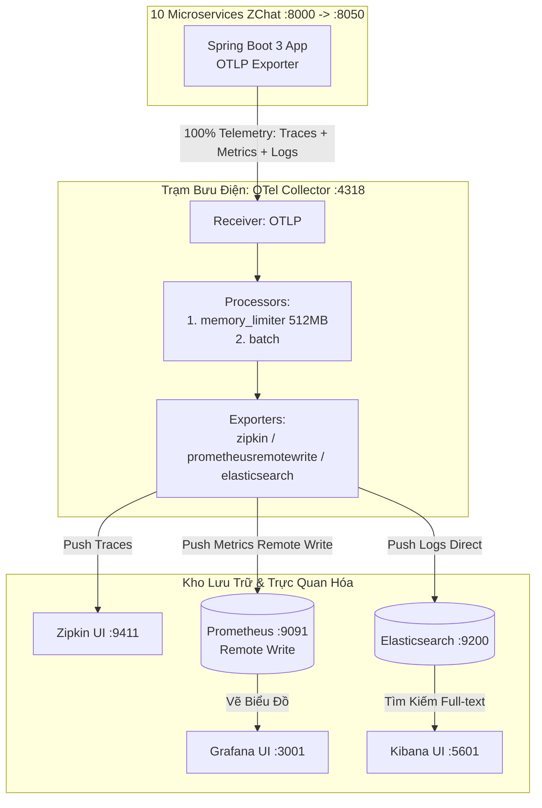

# 🚀 Kịch Bản Tích Hợp Chuẩn Enterprise Thực Thụ: OTel Collector (Traces + Metrics + Logs) + Zipkin + Prometheus + Grafana + Elasticsearch

Tài liệu này nâng cấp kiến trúc giám sát của **ZChat** lên tiêu chuẩn **Doanh nghiệp Thực thụ (True Enterprise Grade)** theo đúng chuẩn Cloud Native.

Toàn bộ 3 trụ cột dữ liệu quan trắc (**Traces, Metrics, Logs**) đều được hội tụ về **1 cổng duy nhất** (`4318`) của **OpenTelemetry Collector**. Collector được trang bị bộ bảo vệ chống tràn RAM (`memory_limiter`) và trực tiếp phân phối dữ liệu sang các kho lưu trữ chuyên dụng mà **không cần Logstash hay Prometheus Scrape lẻ tẻ**.

---

## 1. Bức Tranh Kiến Trúc Chuẩn Enterprise Thực Thụ



---

## 2. Bước 1: Cập nhật `docker-compose.yml` (Đã loại bỏ Logstash & Bật Remote Write)

Bổ sung container `otel-collector` và cấu hình lại Prometheus để cho phép nhận remote write từ Collector:

```yaml
  # ==================== ENTERPRISE OBSERVABILITY STACK ====================

  # 1. Trạm trung chuyển trung tâm OTel Collector
  otel-collector:
    image: otel/opentelemetry-collector-contrib:latest
    container_name: otel-collector
    command: ["--config=/etc/otel-collector-config.yml"]
    volumes:
      - ./otel-collector-config.yml:/etc/otel-collector-config.yml
    ports:
      - "4317:4317" # OTLP gRPC receiver
      - "4318:4318" # OTLP HTTP receiver
    depends_on:
      - zipkin
      - prometheus
      - elasticsearch
    restart: unless-stopped

  # 2. Distributed Tracing UI
  zipkin:
    image: openzipkin/zipkin:latest
    container_name: zipkin
    ports:
      - "9411:9411"
    restart: unless-stopped

  # 3. Metrics Storage (Bật tính năng Remote Write Receiver)
  prometheus:
    image: prom/prometheus:latest
    container_name: prometheus
    command:
      - "--config.file=/etc/prometheus/prometheus.yml"
      - "--web.enable-remote-write-receiver" # BẮT BUỘC để OTel Collector đẩy metrics vào
    volumes:
      - ./prometheus.yml:/etc/prometheus/prometheus.yml
    ports:
      - "9091:9090" # Tránh đụng Keycloak 9090
    restart: unless-stopped

  # 4. Visualization Dashboard
  grafana:
    image: grafana/grafana:latest
    container_name: grafana
    ports:
      - "3001:3000" # Tránh đụng Frontend React 3000
    environment:
      - GF_SECURITY_ADMIN_PASSWORD=admin
    depends_on:
      - prometheus
    restart: unless-stopped
```

*(Lưu ý: Container **Logstash đã được loại bỏ hoàn toàn** giúp tiết kiệm ~300MB RAM, vì OTel Collector sẽ đẩy log thẳng vào Elasticsearch).*

---

## 3. Bước 2: Cấu hình Trạm Bưu Điện `otel-collector-config.yml` (Có Memory Limiter)

Tạo file `otel-collector-config.yml` ngang hàng với `docker-compose.yml`. Định nghĩa đầy đủ 3 pipeline (**Traces, Metrics, Logs**) với bộ bảo vệ `memory_limiter` đứng đầu tiên:

```yaml
receivers:
  otlp:
    protocols:
      grpc:
        endpoint: 0.0.0.0:4317
      http:
        endpoint: 0.0.0.0:4318

processors:
  # BẮT BUỘC: Bảo vệ OTel Collector không bị crash OOM khi traffic tăng đột biến
  memory_limiter:
    check_interval: 1s
    limit_mib: 512
    spike_limit_mib: 128

  # Gom nhóm gói tin tối ưu hiệu năng
  batch:
    timeout: 1s
    send_batch_size: 1024

exporters:
  # 1. Xuất dấu vết sang Zipkin
  zipkin:
    endpoint: "http://zipkin:9411/api/v2/spans"
    format: json

  # 2. Xuất con số sang Prometheus qua cơ chế Remote Write
  prometheusremotewrite:
    endpoint: "http://prometheus:9090/api/v1/write"

  # 3. Xuất nhật ký trực tiếp vào Elasticsearch (Thay thế Logstash)
  elasticsearch:
    endpoints: ["http://elasticsearch:9200"]
    logs_index: "zchat-logs"

  # Debug ra console của Collector
  debug:
    verbosity: basic

service:
  pipelines:
    traces:
      receivers: [otlp]
      processors: [memory_limiter, batch]
      exporters: [zipkin, debug]
    metrics:
      receivers: [otlp]
      processors: [memory_limiter, batch]
      exporters: [prometheusremotewrite, debug]
    logs:
      receivers: [otlp]
      processors: [memory_limiter, batch]
      exporters: [elasticsearch, debug]
```

---

## 4. Bước 3: Cài đặt Exporter Chuẩn Quốc Tế trong `common/pom.xml`

Sử dụng bộ thư viện Exporter chuẩn chung OTLP để gửi toàn bộ Traces, Metrics và Logs:

```xml
<!-- Gửi tín hiệu chuẩn OTLP sang OTel Collector -->
<dependency>
    <groupId>io.opentelemetry</groupId>
    <artifactId>opentelemetry-exporter-otlp</artifactId>
</dependency>
```

---

## 5. Bước 4: Cấu hình Spring Boot phân biệt Môi trường (`application.yml`)

> [!WARNING]
> **Phân biệt địa chỉ Endpoint (Localhost vs Docker Network):**
> * Khi chạy app bằng IDE ngoài máy cục bộ (chưa vào Docker): Endpoint là `http://localhost:4318`.
> * Khi đóng gói app chạy bên trong mạng Docker (Docker Compose): Endpoint phải là `http://otel-collector:4318`.

Cấu hình tối ưu trong `config-server/.../application.yml` sử dụng biến môi trường linh hoạt:

```yaml
management:
  tracing:
    sampling:
      probability: 1.0 # 100% request được ghi nhận
  otlp:
    tracing:
      # Tự động nhận diện: Nếu có biến môi trường OTEL_EXPORTER_OTLP_ENDPOINT thì dùng, không thì mặc định localhost
      endpoint: ${OTEL_EXPORTER_OTLP_ENDPOINT:http://localhost:4318}/v1/traces
    metrics:
      export:
        url: ${OTEL_EXPORTER_OTLP_ENDPOINT:http://localhost:4318}/v1/metrics
        step: 15s
    logs:
      export:
        url: ${OTEL_EXPORTER_OTLP_ENDPOINT:http://localhost:4318}/v1/logs

  endpoints:
    web:
      exposure:
        include: "health,info,prometheus,metrics"
```

*(Khi khai báo trong `docker-compose.yml` cho các service, bạn chỉ cần truyền biến môi trường: `OTEL_EXPORTER_OTLP_ENDPOINT=http://otel-collector:4318`).*

---

## 6. Cấu hình phụ trợ (`prometheus.yml`)

Vì Prometheus hiện tại nhận dữ liệu từ OTel Collector đẩy vào qua Remote Write, file `prometheus.yml` chỉ cần cấu hình đơn giản để duy trì hệ thống:

```yaml
global:
  scrape_interval: 15s

scrape_configs:
  - job_name: 'prometheus-self'
    static_configs:
      - targets: ['localhost:9090']
```

---

## 7. Danh Mục Cổng Truy Cập (Port Directory)

Khởi động hệ thống bằng lệnh `docker-compose up -d`. Bảng tổng hợp cổng vận hành chuẩn Enterprise:

| Dịch vụ / Công cụ | Cổng (Port) | URL Truy cập | Tài khoản | Vai trò trong hệ thống |
| :--- | :---: | :--- | :---: | :--- |
| **OTel Collector**| `4318` | `http://localhost:4318` | — | Trạm trung chuyển duy nhất nhận OTLP Traces/Metrics/Logs |
| **API Gateway** | `8000` | `http://localhost:8000` | — | Mặt tiền duy nhất cho Frontend |
| **User Service** | `8010` | `http://localhost:8010` | — | Microservice quản lý người dùng |
| **Chat Service** | `8020` | `http://localhost:8020` | — | Microservice nhắn tin thời gian thực |
| **Notification** | `8030` | `http://localhost:8030` | — | Microservice thông báo Push/SSE |
| **Search Service** | `8040` | `http://localhost:8040` | — | Microservice tìm kiếm Elasticsearch |
| **Storage Service**| `8050` | `http://localhost:8050` | — | Microservice lưu trữ file MinIO |
| **Grafana UI** | `3001` | `http://localhost:3001` | `admin / admin` | Táp-lô biểu đồ con số Server/APIs |
| **Zipkin UI** | `9411` | `http://localhost:9411` | — | Sa bàn theo dõi thời gian phản hồi |
| **Kibana UI** | `5601` | `http://localhost:5601` | — | Tra cứu log văn bản lỗi theo `TraceId` |
| **Prometheus** | `9091` | `http://localhost:9091` | — | Kho dữ liệu Time-series (Nhận qua Remote Write) |
