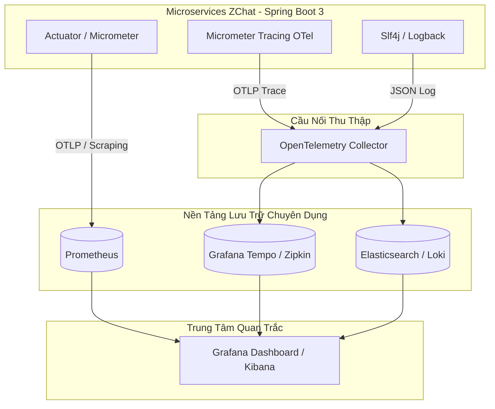

# 🏛️ Hệ Thống Hóa Kiến Thức: Các Trụ Cột Quan Trắc Hệ Thống (The Three Pillars of Observability)

Trong kiến trúc Microservices phức tạp như **ZChat**, việc chỉ có "Nhật ký lỗi" là không đủ để vận hành. Chuẩn mực công nghiệp toàn cầu (CNCF) chia khả năng quan trắc hệ thống thành **3 trụ cột cốt lõi (Three Pillars of Observability)**: **Metrics**, **Tracing**, và **Logging**.

---

## 1. Bản Chất Và Vai Trò Của Từng Trụ Cột

| Tiêu chí | 📊 Metrics (Nhịp tim) | 🏎️ Tracing (Hành trình) | 📜 Logging (Câu chuyện) |
| :--- | :--- | :--- | :--- |
| **Định nghĩa** | Dữ liệu dạng **con số tổng hợp** theo chu kỳ thời gian (Time-series). | Dữ liệu dạng **dấu vết liên thông** qua các dịch vụ theo 1 request. | Dữ liệu dạng **văn bản mô tả** sự kiện xảy ra tại một thời điểm. |
| **Câu hỏi cốt lõi** | *“Hệ thống có đang gặp vấn đề gì không?”* (Phát hiện sự cố nhanh) | *“Vấn đề xảy ra ở bước nào, dịch vụ nào?”* (Định vị điểm chậm/nghẽn) | *“Nguyên nhân sâu xa chi tiết của sự cố là gì?”* (Chẩn đoán code) |
| **Đặc điểm lưu trữ** | Cực kỳ nhỏ gọn, tốn ít RAM/Disk, dễ vẽ biểu đồ Real-time. | Trung bình (lưu các mốc thời gian Start/End, TraceId, SpanId). | Rất lớn, tốn dung lượng Disk, cần cơ chế xoay vòng (Log Rotation). |
| **Ví dụ trong ZChat** | `jvm_memory_used_bytes = 512MB` `http_server_requests_seconds_count = 1200` | `GET /api/v1/search`  ├── Gateway (2ms)  └── SearchService (15ms) | `2026-06-27 10:00:01 ERROR [user-service] NullPointerException at line 19` |

---

## 2. Bản Đồ Công Nghệ Tiêu Chuẩn (Technology Landscape)

Mỗi trụ cột sở hữu một tập hợp công cụ chuyên biệt từ khâu **Tạo dữ liệu (Instrumentation)** ➔ **Thu thập (Collector)** ➔ **Lưu trữ (Storage)** ➔ **Trực quan hóa (Visualization)**:

### 🧰 Các đại diện công nghệ tiêu biểu:

1. **Tầng Metrics (Đo lường con số):**
   * *Tạo dữ liệu*: **Micrometer** (Tiêu chuẩn mặc định của Spring Boot Actuator).
   * *Lưu trữ*: **Prometheus** (Pull model), **VictoriaMetrics**, **InfluxDB**.
   * *Trực quan*: **Grafana Dashboard**.

2. **Tầng Tracing (Theo dõi phân tán):**
   * *Tạo dữ liệu*: **OpenTelemetry SDK**, **Brave**.
   * *Giao thức truyền header*: **W3C Trace Context** (`traceparent`).
   * *Lưu trữ & Hiển thị*: **Grafana Tempo**, **Jaeger**, **Zipkin**.

3. **Tầng Logging (Nhật ký sự kiện):**
   * *Tạo dữ liệu*: **Logback**, **Log4j2** (kết hợp `LogstashEncoder` xuất dạng JSON).
   * *Thu thập & Đẩy đi*: **Fluentd**, **Fluentbit**, **Logstash**, **Promtail**.
   * *Lưu trữ*: **Elasticsearch** (trong ELK Stack), **Grafana Loki** (trong LGTM Stack).

---

## 3. Tam Giác Phối Hợp Khi Xử lý Sự Cố (The Triage Workflow)

Một kỹ sư hệ thống chuyên nghiệp không bao giờ nhảy bổ vào đọc hàng triệu dòng log ngay từ đầu. Hành trình chuẩn xử lý một sự cố trên Production diễn ra theo 3 bước tuần tự:

> [!IMPORTANT]
> **Quy trình chuẩn 3 bước xử lý sự cố:**
> 1. **Bước 1: Xem Metrics** ➔ Nhận cảnh báo tổng quan (Phát hiện *CÓ* sự cố).
> 2. **Bước 2: Xem Tracing** ➔ Tìm đích danh dịch vụ lỗi & gắp `TraceId` (Khoanh vùng *Ở ĐÂU*).
> 3. **Bước 3: Xem Logging** ➔ Tìm nguyên văn câu báo lỗi theo `TraceId` (Chẩn đoán *TẠI SAO*).

Ví dụ thực tế:
1. **Bước 1 (Metrics)**: Kỹ sư nhận tin nhắn Telegram từ Grafana Alert: *"Cảnh báo: Tỷ lệ lỗi 500 của API `POST /api/v1/chat/message` vượt quá 5% trong 2 phút qua!"*
2. **Bước 2 (Tracing)**: Kỹ sư mở **Grafana Tempo**, lọc các request bị lỗi 500. Biểu đồ thời gian hiện ra: 
   `Gateway` (hợp lệ) ➔ `Chat Service` (hợp lệ) ➔ `Kafka` ➔ 🔴 `Storage Service` (Timeout 5000ms). Kỹ sư gắp được mã **`TraceId = 84a3b2c1d2e3f4a5`**.
3. **Bước 3 (Logging)**: Kỹ sư dán `TraceId = 84a3b2c1d2e3f4a5` vào **Kibana / Loki**. Màn hình lập tức hiện ra dòng log:
   `ERROR MinioException: S3 Storage bucket 'zchat-files' is full or read-only`.
   ➔ *Kết luận*: Ổ cứng S3 bị đầy.

---

## 4. Kiến Trúc "Đời Mới": Bộ Tứ LGTM của Grafana vs ELK truyền thống

Hiện nay thế giới công nghệ chia làm 2 trường phái lớn:

* **Trường phái ELK truyền thống** (*Elasticsearch - Logstash - Kibana*): Rất mạnh về tìm kiếm văn bản phức tạp, nhưng **cực kỳ nặng**, tốn rất nhiều RAM và chi phí ổ cứng SSD cho Elasticsearch.
* **Trường phái LGTM hiện đại** (*Loki - Grafana - Tempo - Mimir*): Được thiết kế tối ưu cho Cloud Native. Thay vì index toàn bộ từ trong log, **Loki** chỉ index các nhãn (`service`, `level`, `traceId`), giúp tiết kiệm đến **80% chi phí phần cứng** so với ELK.

> **💡 Khuyến nghị cho ZChat**: Với quy mô microservices vừa và lớn, việc áp dụng chuẩn **OpenTelemetry + Grafana LGTM Stack** là lựa chọn thông minh nhất hiện nay!
