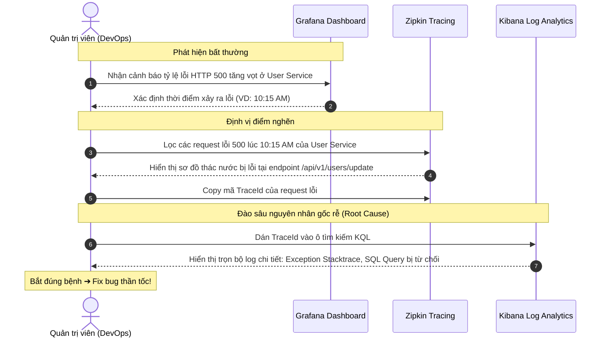

# 📖 Sổ Tay Hướng Dẫn Sử Dụng & Vận Hành Hệ Thống Quan Trắc Enterprise (Observability Stack)

Tài liệu này cung cấp hướng dẫn thực chiến từng bước để lập trình viên và quản trị viên hệ thống (DevOps) khai thác tối đa sức mạnh của bộ tứ quan trắc **Zipkin - Grafana - Prometheus - Kibana** trong dự án **ZChat**.

---

## 1. 🚀 Khởi Động & Kiểm Tra Sức Khỏe Hạ Tầng

### Khởi chạy Stack bằng Docker Compose
Mở Terminal tại thư mục gốc dự án và chạy lệnh:
```bash
docker-compose up --build -d
```

### Bảng Kiểm Tra Trạng Thái Cổng Vận Hành (Health Check Table)
Hãy đảm bảo các dịch vụ dưới đây đều ở trạng thái `Running` (Up):

| Dịch vụ | Cổng (Port) | URL Truy cập | Tài khoản mặc định | Ý nghĩa chức năng |
| :--- | :---: | :--- | :---: | :--- |
| **OTel Collector** | `4318` / `4317` | `http://localhost:4318` | *Không có* | Trạm bưu điện trung tâm nhận OTLP Traces/Metrics/Logs |
| **Zipkin UI** | `9411` | `http://localhost:9411` | *Không có* | Giao diện theo dõi thời gian phản hồi API (Tracing Waterfall) |
| **Grafana UI** | `3001` | `http://localhost:3001` | `admin` / `admin` | Táp-lô biểu đồ sinh tồn Server & API (Metrics Visualization) |
| **Prometheus** | `9091` | `http://localhost:9091` | *Không có* | Kho lưu trữ time-series nhận dữ liệu Remote Write |
| **Kibana UI** | `5601` | `http://localhost:5601` | *Không có* | Cổng tra cứu tìm kiếm log tập trung (Log Analytics) |
| **Elasticsearch**| `9200` | `http://localhost:9200` | *Không có* | Kho lưu trữ log full-text (Đã bật Healthcheck) |

---

## 2. 🕵️ Hướng Dẫn Phân Tích Dấu Vết với Zipkin (`:9411`)

Khi một người dùng bấm gửi tin nhắn hoặc cập nhật ảnh đại diện, request đó có thể đi qua `api-gateway` ➔ `user-service` ➔ `storage-service`. Zipkin giúp bạn nhìn thấy toàn bộ hành trình này.

### Cách tra cứu một API chậm / lỗi:
1. Mở trình duyệt vào **`http://localhost:9411`**.
2. Nhấp vào nút **"Run Query"** hoặc chọn lọc theo **Service Name** (ví dụ: `user-service`).
3. Nhấp vào một **Trace** cụ thể để mở sơ đồ thác nước (**Waterfall Diagram**):
   * Thanh ngang màu xanh/đỏ thể hiện thời gian tiêu tốn (Duration) tại từng microservice.
   * Nếu API bị chậm, bạn sẽ nhìn thấy ngay thanh ngang của service nào dài nhất (ví dụ: mất 500ms tại đoạn query Database).
4. **Lưu lại mã `TraceId`:** Ở góc trên bên trái của trang chi tiết, bạn sẽ thấy một chuỗi dài (ví dụ: `0a5421fcb903ecee699f293bcba5a119`). Hãy copy mã này để tra cứu log lỗi ở Kibana.

---

## 3. 📊 Hướng Dẫn Giám Sát Chỉ Số với Grafana & Prometheus (`:3001`)

Grafana giúp bạn biến những con số khô khan thành biểu đồ trực quan để phát hiện sớm nguy cơ sập server (OOM RAM, tràn CPU).

### Bước 1: Kết nối Data Source Prometheus
1. Đăng nhập vào Grafana tại **`http://localhost:3001`** (`admin`/`admin`).
2. Vào **Connections** ➔ **Data sources** ➔ **Add data source** ➔ Chọn **Prometheus**.
3. Tại ô **Prometheus server URL**, nhập chính xác: `http://prometheus:9090` *(lưu ý dùng tên container `prometheus` và cổng nội bộ `9090`)*.
4. Bấm **Save & test** ở dưới cùng. Nếu báo màu xanh *"Successfully queried the Prometheus API"* là thành công!

### Bước 2: Import Dashboard chuẩn Spring Boot 3 (JVM / Micrometer)
Không cần tự vẽ biểu đồ từ đầu, bạn có thể dùng sẵn Dashboard chuẩn của cộng đồng toàn cầu:
1. Nhấp vào dấu cộng **"+"** ở menu bên trái ➔ **Import dashboard**.
2. Tại ô **Import via grafana.com**, nhập mã ID: **`4701`** (hoặc **`11378`**) rồi bấm **Load**.
3. Chọn Data Source là **Prometheus** vừa tạo ➔ Bấm **Import**.
4. **Thành quả:** Bạn sẽ có ngay một bảng điều khiển siêu đẹp hiển thị:
   * **JVM Memory:** Lượng RAM Heap/Non-Heap đang sử dụng của từng microservice.
   * **CPU Usage:** % CPU server đang tiêu thụ.
   * **HTTP Requests:** Số lượng request trên giây (RPS) và tỷ lệ lỗi 4xx/5xx.

---

## 4. 📝 Hướng Dẫn Tra Cứu Nhật Ký Tập Trung với Kibana (`:5601`)

Thay vì phải mở terminal gõ `docker logs` cho 10 container khác nhau, toàn bộ log của ZChat đã được hội tụ về Kibana.

### Bước 1: Tạo Data View (Lần đầu truy cập)
1. Mở Kibana tại **`http://localhost:5601`**.
2. Vào menu bên trái ➔ **Stack Management** ➔ **Data Views** ➔ **Create data view**.
3. Tại ô **Name**, nhập: `ZChat Logs`.
4. Tại ô **Index pattern**, nhập: `zchat-logs*` *(Đây là chỉ mục mà OTel Collector đã cấu hình đẩy vào)*.
5. Chọn Timestamp field là `@timestamp` ➔ Bấm **Save data view**.

### Bước 2: Kỹ Thuật Điều Tra Sự Cố Thần Tốc (KQL Search)
Khi khách hàng báo lỗi hệ thống vào lúc 14:30, đây là cách bạn điều tra ra nguyên nhân trong 30 giây:
1. Vào menu **Discover** trên Kibana.
2. Lấy mã **`TraceId`** bạn copy được từ Zipkin hoặc Grafana (ví dụ `0a5421fcb903ecee699f293bcba5a119`).
3. Gõ vào ô tìm kiếm KQL của Kibana:
   ```kql
   traceId : "0a5421fcb903ecee699f293bcba5a119"
   ```
4. **Kết quả:** Kibana sẽ lọc ra **chính xác toàn bộ các dòng log** liên quan đến request đó, từ lúc bước vào `api-gateway`, đi qua `user-service`, cho đến câu lệnh SQL lỗi tại `storage-service`. Bạn sẽ nhìn thấy ngay dòng `ERROR NullPointerException` nằm ở file nào, dòng số mấy!

---

## 5. 🔄 Sa Bàn Quy Trình Xử Lý Sự Cố (Incident Response Workflow)

Để dễ hình dung, dưới đây là sơ đồ quy trình phối hợp 3 công cụ khi xảy ra sự cố trên môi trường Production:


